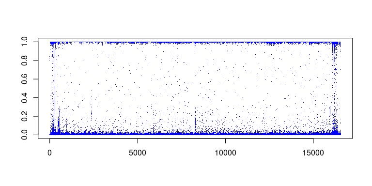
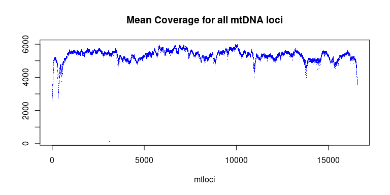

<!-- README.md is generated from README.Rmd. Please edit that file -->

# ANNOmtDNA

### Association analysis of heteroplasmic mtDNA mutations.

**Authors:** Xianbang Sun (maintainer, <sxb3000@bu.edu>), Katia
Bulekova, Chunyu Liu, Jessica L. Fetterman, Jun Ding, Kaiyu Yan, Daniel
Levy<br> **Date:** “08/09/2020”

<!-- badges: start -->

<!-- badges: end -->

ANNOmtDNA is an R package for identifying and annotating mtDNA sequence
variations. This package allows to identify mtDNA sequence variations
with user-specified thresholds, and provide several plots to visualize
mtDNA sequence variations. It also annotates all mtDNA variations and
predicts functionality for mtDNA variants in the coding and tRNA
regions.

*Note:* if you use ANNOmtDNA in published research, please cite:

Xianbang Sun, Katia Bulekova, Chunyu Liu, Jessica L. Fetterman, Jun
Ding, Kaiyu Yan, Daniel Levy (2020) mtdnaANNO: an R package for
comprehensive annotation of mtDNA sequence variation

## Installation

You can install the development version of ANNOmtDNA package from
[GitHub](https://github.com/) with:

``` r
# install.packages("devtools")
devtools::install_github("mtDNA-BU/ANNOmtDNA")
#> Skipping install of 'ANNOmtDNA' from a github remote, the SHA1 (c04351fa) has not changed since last install.
#>   Use `force = TRUE` to force installation
library(ANNOmtDNA)
```

## Standard workflow

Import the original allele, frequency and coverage datasets

``` r
input_path = "/path/to/input/directory/"
```

``` r
allele <- read.csv(paste0(input_path, "allele/allele_ANNOmtDNA.csv"), header = T, stringsAsFactors=FALSE,
                   colClasses = c("character"))
freq <- read.csv(paste0(input_path,"freq/freq_ANNOmtDNA.csv"), header=T, stringsAsFactors=FALSE,
                      colClasses = c("character"))
coverage <- read.csv(paste0(input_path,"coverage/coverage_ANNOmtDNA.csv"), header=T)
allele <- as.matrix(allele)
freq <- as.matrix(freq)
coverage <- data.matrix(coverage)
```

#### Compute alternative allele fraction (AAF) by mtAAF function

``` r
AAF <- mtAAF(allele, freq)
```

Scatter plot of output of mtAAF function, each point is AAF of a subject
at a locus, the x axis is the mtDNA loci and the y axis is the range of
AAF (0-100%)

``` r
plot(AAF)
```

<!-- -->

Plot the mean coverage of each locus by plotCover function, the x axis
is the mtDNA loci and y axis is the mean coverage

``` r
plotCover(coverage)
```

<!-- -->

Histogram of the mean coverage of each subject by histSampCov function

``` r
histSampCov(coverage)
```

<!-- -->

#### Summarize and annotate mtDNA mutations by mtSummary function

Specify the path to output the annotation file and histograms of mtDNA
mutation burden of subjects and number of mutations carried by each loci
for heteroplasmic and homoplasmic mutations

Users can specify lower bound and upper bound of the threshold by
thre.lower and thre.upper arguments. By default, thre.lower=0.03 and
thre.upper=0.97. That is, if \(0.03\leq AAF\leq 0.97\), it is a
heteroplasmic mutation; and if \(AAF>0.97\), it is a homoplasmic
mutation. Users can also choose different gene regions by loci argument.
For example, to choose tRNA region, set loci=“tRNA”. Users can also
choose types of mutations to be annotated by type argument. For example,
to choose heteroplasmic mutations, set type=“heter”, and choose
homoplasmic mutations, set type=“homo”. Run the mtSummary function, only
include loci of coding region, annotate for both of heteroplasmic and
homoplasmic mutations.

``` r
 output_path <- "/output/dir/"
```

``` r
mtSum <- mtSummary(aaf=AAF, allele=allele, freq=freq, coverage=coverage, loci="coding"
         , path=output_path, type="both", study="ARIC")
```

Part of the output of annotated alleles

    #>   mtID ref_allele allele_var n_var n_heter n_homo mut_allele  Pos ref Gene
    #> 1 3308          T      T/C/G    45       3     42          C 3308   5   91
    #> 2 3308          T      T/C/G    45       3     42          G 3308   5   91
    #>   TypeMutation MissensMutation CodonPosition ProteinDomain dbSNP_150_id
    #> 1            2            4095             2            NA           83
    #> 2            5            4173             2            NA           NA
    #>   PolyPhen2 PolyPhen2_score SIFT SIFT_score CADD CADD_score
    #> 1         3            0.99    1          0    1       2.36
    #> 2        NA              NA   NA         NA   NA         NA
    #>   CADD_phred_score
    #> 1            18.57
    #> 2               NA

Output of PDF file of histograms of summarized mutations
<embed src="/scratch/43046.1.ood/Rtmpmz5Evl//mtHistograms.pdf" width="100%" height="300%" style="display: block; margin: auto;" type="application/pdf" />

Summary of the mean coverage of loci

``` r
mtSum$coverLoci 
#>    Min. 1st Qu.  Median    Mean 3rd Qu.    Max. 
#>    4136    5315    5534    5520    5719    6231
```

Summary of the mean coverage of subjects

``` r
mtSum$coverSubjects  
#>    Min. 1st Qu.  Median    Mean 3rd Qu.    Max. 
#>   935.7  4338.6  5325.6  5520.2  6469.6 16544.7
```

Display loci of variation

``` r
mtSum$loci_var  
```

Summary of the heteroplasmic burden of subjects

``` r
mtSum$heter_burden_sum  
#>    Min. 1st Qu.  Median    Mean 3rd Qu.    Max. 
#>  0.0000  0.0000  0.0000  0.3973  1.0000 68.0000
```

Summary of numbers of heteroplasmic mutations loci carried

``` r
mtSum$heter_loci_sum  
#>    Min. 1st Qu.  Median    Mean 3rd Qu.    Max. 
#>  0.0000  0.0000  0.0000  0.1411  0.0000 25.0000
```

Display loci of heteroplasmy

``` r
mtSum$loci_heter  
```

Total Number of heteroplasmic mutations

``` r
mtSum$heter_total  
#> [1] 1600
```

Summary of the homoplasmic burden of subjects

``` r
mtSum$homo_burden_sum  
#>    Min. 1st Qu.  Median    Mean 3rd Qu.    Max. 
#>    0.00    6.00   14.00   13.32   18.00   61.00
```

Summary of numbers of homoplasmic mutations loci carried

``` r
mtSum$homo_loci_sum  
#>     Min.  1st Qu.   Median     Mean  3rd Qu.     Max. 
#>    0.000    0.000    0.000    4.729    0.000 3972.000
```

Display loci of homoplasmy

``` r
mtSum$loci_homo  
```

Total Number of homoplasmic mutations

``` r
mtSum$homo_total  
#> [1] 53633
```

#### Annotate alternative alleles by mtAnno function

Generate alternative alleles to be annotated for mtDNA loci. It has two
columns: loci positions (“pos”) and “alleles” to be annotated.

``` r
anno <- as.data.frame(matrix(0, 10, 2))
colnames(anno)<- c("pos", "alleles")
anno$pos <- c(3311:3320)
anno$alleles <- c("A", "A", "T", "C", "A", "T", "G", "A", "C", "T")
```

Run the mtAnno function

``` r
mtAnno(anno=anno, path=output_path)
```

Part of the output of annotated alleles

    #>    pos alleles  Pos ref Gene  TypeMutation MissensMutation CodonPosition
    #> 1 3311       A 3311   C  ND1 Nonsynonymous             P2H             2
    #>            ProteinDomain dbSNP_150_id PolyPhen2 PolyPhen2_score    SIFT
    #> 1 Transmembrane; Helical           NA    benign            0.01 neutral
    #>   SIFT_score        CADD CADD_score CADD_phred_score
    #> 1       0.34 deleterious       2.45            19.12
